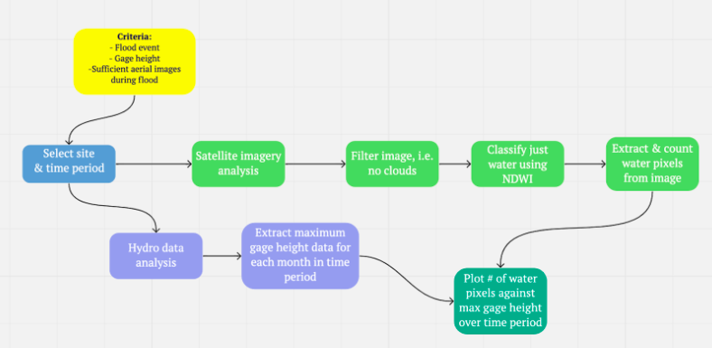

# Earth Lab + RIMORPHIS
Authors: Avra Saslow & Kristen Tortorelli

  > This repository is for a research project for improving flood detection with a focus on comparing stream gage discharge data against satellite imagery in order to determine at which point we can detect overbank flooding. We're working in conjunction with the NSF funded project RIMORPHIS to ultimately assist in modeling streamflow and overbank flooding across the US.

This workflow utilizes both Google Earth Engine (GEE) and the National Water Information System (NWIS).

## Table of Contents
* [Development Environment](https://github.com/earthlab-education/final-project-group-blog-post-rimorphis#development-environment)
* [Workflow](https://github.com/AvraSaslow/ea-rimorphis#workflow)
* [Notebooks](https://github.com/AvraSaslow/ea-rimorphis#notebooks)
* [References](https://github.com/AvraSaslow/ea-rimorphis#references)
* [Contact](https://github.com/AvraSaslow/ea-rimorphis#project-contacts)

## Project Purpose and Goals
The premise of this research project is to contextualize flooding with satellite data, rather than relying on stream gage data to indicate whether or not water levels are above a flood threshold. It's important to model overbank flooding because it's crucial to understand _where_ and _how_ exactly a landscape floods. The ability to monitor and predict the extent of flooding across a landscape is critical for managing phenomena such as agricultural irrigation and habitat conservation. 

This cannot just be done with stream gage data; stream gage data only tells us when the water level or flow is above a certain threshold. Moreover, gauging stations generally fail to provide accurate flow observations during extreme events due to the distributed complex nature of flood processes.

Utilizing other data types, such as satellite imagery, can provide a better understanding of how rivers flood. It's important to see not only where on a floodplain the water travels to, but where that water carries sediment loads to as well. That's why our research is comprised of modelling where stream gage data (i.e., water volume) and satellite imagery (i.e., water area) converge, because it could give us a better understanding of _where_ water and and sediment go when water levels hit a flood level threshold.

This research sits under the umbrella of a larger research effort called the River Morphology Information System, or RIMORPHIS, which is a USF-funded, collaborative project. The goal of RIMORPHIS is to create a user-friendly information system that enables its community to observe and record important variables for modeling streamflow and sediment transport across the U.S.

Our piece of research fits into that mission because it evaluates if multiple methods of measurement create a stronger and more accurate model for overbank flooding, rather than relying on a single data point (such as precipitation, or stream gage data). 

To narrow our scope of work, we decided to specifically study flood events at 1-3 locations that had both stream gage or stream height data and clear enough satellite images. For this stage in our study, we're simply looking to find if there is any correlation between stream gage/height data and the number of water pixels counted for the same time period in the study area. 

## Data Sources
### NWIS Data

The National Water Information System (NWIS) provides access to water-related data at over 1.5 million sites in the United States, and therefore can provide stream gage discharge data and gage height data. This project's notebooks use the hydrofunctions library from USGS to extract stream discharge and gage height data for all sites.

* [Stream discharge and gage height data for the Vicksburg, Mississippi gage site](https://waterdata.usgs.gov/nwis/inventory/?site_no=07289000&agency_cd=USGS)
* [Gage height data for Pine Bluff, Arkansas gage site](https://waterdata.usgs.gov/usa/nwis/uv?site_no=07263650)

### Sentinel-2 data

Sentinel-2 is a wide-swath, high-resolution, multi-spectral imaging mission which supports the monitoring of vegetation, soil and water cover. Sentinel-2 data over both gage sites can be downloaded from the https://earthexplorer.usgs.gov/ site. This project's notebooks use Google Earth Engine to download Sentinel-2 images for all sites over a number of date ranges.

## Development Environment
The notebooks were developed using Python 3.9.5 on a Mac system. The workflow utilizes packages from Google Earth Engine, Hydrofunctions, Folium, Geemap, and Matplotlib. The workbook was developed using the earth-analytics-python environment.

Installation instructions for the earth analytics python environment can be found [here.](https://www.earthdatascience.org/workshops/setup-earth-analytics-python/setup-python-conda-earth-analytics-environment/)

## Workflow

### How to Run Workflow 
Navigate to the rimorphis_final_project_blog_post_saslow_tortorelli.ipynb file in this repository. Run this workbook, and follow the authentication steps that appear for using GEE. Once you have provided your credentials, copy the authentication token into the notebook to complete authentication process. At the end of the notebook, an html file is exported to the working directory. 

## Notebooks
Additional "explorations" notebooks have been included showing more of the process completed to finalize the workflow.

Exploratory Notebooks:
* Hydrofunctions workflow: Hydrofunctions Exploratory Notebook.ipynb
* Google Earth Engine workflow: Google Earth Engine Exploratory Notebook.ipynb
* Time series automation workflow: Automation Workflow.ipynb
* Stream Gage vs Sentinel 2 water pixel comparison workflow: Stream Gage vs Sentinel-2 Workflow.ipynb

Working Notebook:
* rimorphis_final_project_blog_post_saslow_tortorelli.ipynb

## References

## Project Contacts

[@Avra Saslow](mailto:avra.saslow@colorado.edu) 
[@Kristen Tortorelli](mailto:kristen.tortorelli@colorado.edu) 
[@Elsa Culler](mailto:elsa.culler@colorado.edu ) 

## Zenodo Citation

